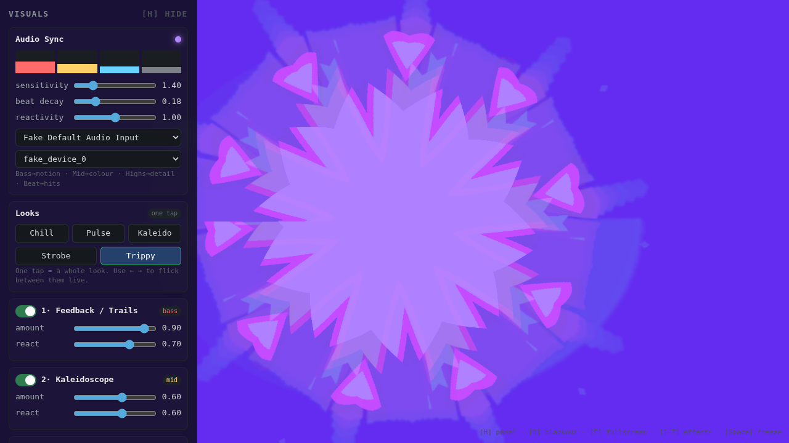

# Visuals

A browser-based, webcam-driven live visualiser. Point a camera at the room (or
yourself), and the image reacts **in time with the music** — bass drives the
motion, mids drive the colour, highs drive the detail, and detected beats fire
the hits. No install, no account, no backend.

It's a self-contained **extra** visual source — it sits alongside whatever rig
a DJ already uses, it doesn't replace it.



## Use it in 10 seconds (anyone can)

1. Open `index.html` over `https://` or `localhost` (camera needs a secure origin).
2. Click **Start visuals** and allow camera + microphone.
3. Tap a **Look** — *Chill, Pulse, Kaleido, Strobe, Trippy*. That's it. Each look
   is a complete, music-synced configuration; you don't have to touch a slider.
4. Flick between looks live with the **← →** arrow keys.

Everything past that is optional fine-tuning.

## Making it feel locked to the music

The visuals are driven by live audio analysis built for *tightness*, not a vague
brightness wobble:

- **Separate frequency bands** — bass / mid / high are analysed independently so
  different effects react to different parts of the mix.
- **Snappy envelopes** — each band has instant attack and a tunable release, so a
  kick *pops* and doesn't smear into the next beat.
- **Beat detection** — instantaneous bass energy is compared against its running
  average with a refractory window, firing a decaying "beat" impulse that the
  effects use for hits (zoom punches, RGB stabs, strobing).

Three controls tune the feel:

- **sensitivity** — how easily beats trigger.
- **beat decay** — how long a hit lingers (shorter = punchier/strobier).
- **reactivity** — overall amount the audio pushes the visuals.

The four meters and the dot by "Audio Sync" show the live signal and beats so you
can confirm it's hearing the music.

## Fitting into a standard DJ / VJ setup

It's designed to drop into a normal booth without special hardware:

**Audio in** — pick any input from the audio dropdown. A laptop mic pointed at
the speakers works instantly; for a clean feed, select a **line-in / USB audio
interface / mixer booth-out**, or a **loopback device** (e.g. BlackHole on macOS,
VB-CABLE on Windows) to read the system mix directly. Echo cancellation / noise
suppression / auto-gain are disabled so the music comes through unprocessed.

**Video out** — press **Output → screen** (`O`). That opens a clean, UI-free
output window. From there you can either:

- **Fullscreen it on the projector / second display** (double-click the output
  window), or
- **Window-capture it into your existing software** — OBS, Resolume, VDMX, or an
  NDI tool via window/Syphon/Spout capture — so it becomes just another layer in
  the rig you already run.

The control panel stays on your laptop screen while the output goes to the wall.

## Controls

| Key | Action |
|-----|--------|
| `1`–`7` | toggle each effect |
| `← →` | flick between Looks |
| `B` | blackout / fade to black |
| `O` | open clean output window |
| `F` | fullscreen |
| `H` | hide/show the panel |
| `Space` | freeze the frame |

**Presets:** save the current setup by name (stored locally), and **Export** /
**Import** a preset as JSON to carry a set between machines.

## Effects

Feedback/trails · kaleidoscope · displace · RGB split · posterize · pixelate ·
hue cycle. They run as a fixed, ordered chain of WebGL2 shader passes (camera →
effects → feedback ping-pong → output), each toggleable with an *amount* and an
*audio react* control.

## Running locally

Any static server over a secure origin:

```sh
python3 -m http.server 8000
# then open http://localhost:8000
```

Pure client-side: vanilla JS + WebGL2, no build step, no dependencies.
See `PLAN.md` for the design and roadmap.
